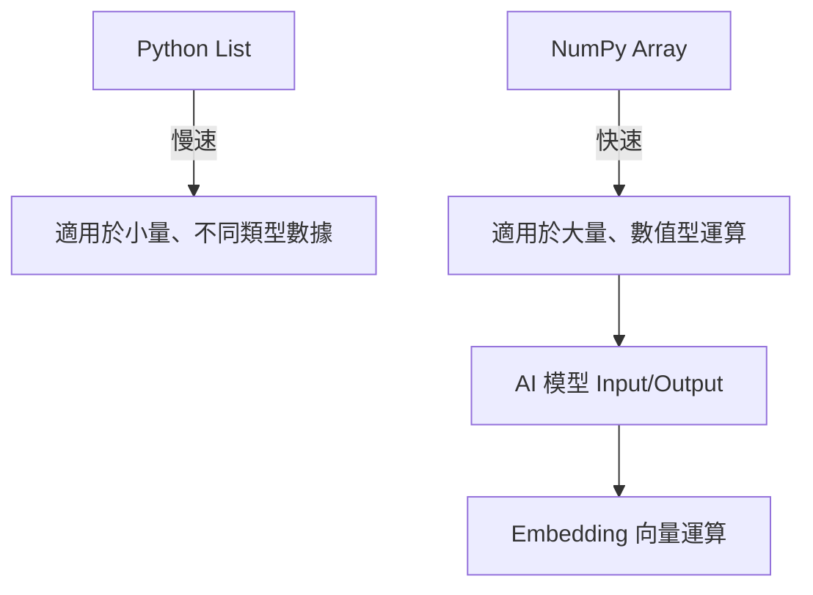

# Day 17：Python 基礎進階與 NumPy 入門 (AI 開發必備)

## 🎯 學習目標

- 掌握 Python 的高級特性（列表推導式、字典、Lambda）。
- 理解 NumPy 陣列 (ndarray) 與列表 (list) 的區別。
- 學會 NumPy 的基礎操作（建立、重塑、基本運算）。
- 理解為何 AI 需要向量 (Vector) 運算。

---

## 📚 學習資源

- **NumPy 官方文檔 (必讀)**: [NumPy Quickstart](https://numpy.org/doc/stable/user/quickstart.html)
- **Python 官方教學**: [Data Structures](https://docs.python.org/3/tutorial/datastructures.html)
- **向量相似度原理 (選讀)**: [Cosine Similarity Explained](https://en.wikipedia.org/wiki/Cosine_similarity)

---

## 🛠️ 新手必会知识点 (附例子)

### 1. Python List (列表) vs. NumPy Array (数组)

这是 AI 开发中最基础的概念。

- **List**: 灵活，但计算慢。
- **Array**: 严谨（类型一致），计算极快。

**代码对比实验：**

```python
import numpy as np
import time

# 创建一个包含 100 万个数字的列表
my_list = list(range(1000000))
# 创建一个包含 100 万个数字的 NumPy 数组
my_array = np.array(my_list)

# 实验：给每个数字乘以 2
# 1. 使用 List (传统 for 循环)
start = time.time()
list_result = [x * 2 for x in my_list]
print(f"List (for loop) time: {time.time() - start:.4f}s")

# 2. 使用 NumPy (向量化运算)
start = time.time()
array_result = my_array * 2 # 这就是“广播”机制，不需要写循环！
print(f"NumPy (Vectorized) time: {time.time() - start:.4f}s")
```

_(你会发现 NumPy 的速度通常比 List 快几十倍甚至上百倍！)_

### 2. 什么是向量 (Vector)？

在 AI 中，我们把一段文字变成一串数字（如 `[0.1, -0.2, 0.5...]`），这串数字就叫 **Embedding（嵌入向量）**。本质就是一个np array

- **维度 (Dimension)**：向量里数字的个数。
- **相似度**：如果两个向量的数字很接近，说明这两段文字的意思很接近。

---

## 🧠 逻辑架构说明 (Mermaid 图示)



在 AI 領域，我們很少使用 `for` 循環來處理數據，而是將數據轉化為 NumPy 陣列進行矩陣運算。

---

## 💻 完整可運行範例：計算兩個向量的相似度 (模擬 RAG 檢索)

這是 RAG (檢索增強生成) 的核心邏輯：計算用戶問題向量與文檔向量的距離。

```python
import numpy as np

def calculate_similarity(vec1, vec2):
    """
    Calculate the cosine similarity between two vectors.
    """
    #1.  计算点积 - 衡量两个向量的对齐程度【 数值越大，两个向量越'指向同一个方向‘】
    # 点积公式: x₁×x₂ + y₁×y₂
    dot_product=np.dot(vec1,vec2)

    #2. 第二步：计算模长，也就是两个向量的长度
    # 模长公式 √(x² + y²)
    norm1=np.linalg.norm(vec1)
    norm2=np.linalg.norm(vec2)

    #3.余弦相似度（只看方向，去除长度的影响）
    # 非常适合文本，我们不关心句子的长度，只关心内容
    # 公式：点积 / (模长A * 模长B)
    similarity=dot_product / (norm1 * norm2)
    return similarity

# --- Main Execution ---
if __name__ == "__main__":
    # Mock Embedding Vector 1 (User Query)
    query_vec = np.array([0.1, 0.5, 0.2, 0.9])

    # Mock Embedding Vector 2 (Document A - Related)
    doc_a_vec = np.array([0.15, 0.45, 0.25, 0.85])

    # Mock Embedding Vector 3 (Document B - Unrelated)
    doc_b_vec = np.array([0.9, 0.1, 0.1, 0.1])

    # Perform calculations
    sim_a = calculate_similarity(query_vec, doc_a_vec)
    sim_b = calculate_similarity(query_vec, doc_b_vec)

    print(f"Similarity with Document A (Related): {sim_a:.4f}")
    print(f"Similarity with Document B (Unrelated): {sim_b:.4f}")

    # Compare
    if sim_a > sim_b:
        print("Result: Document A is more relevant to the query.")
    else:
        print("Result: Document B is more relevant to the query.")
```

---

## 📝 本日練習

1. 修改上面的範例，增加一個 `doc_c_vec` 向量，隨意填寫數字，觀察它的相似度。
2. 嘗試使用 `np.reshape` 將一個長度為 6 的一維陣列轉換成 (2, 3) 的矩陣。
3. 思考：為什麼在處理 100 萬個向量時，我們不能使用 Python 的 `for` 循環？
    * 时间太慢
    * 一般documents对比做法：向量化 + FAISS

