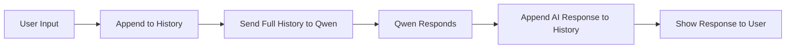

# Day 18：複習日 - 多輪對話與 System Prompt 深度實踐 (Qwen 版)

## 🎯 學習目標
*   鞏固多輪對話 (Multi-round Chat) 的實現邏輯。
*   掌握如何透過 System Prompt 精準控制 AI 的人設與行為。
*   理解消息列表 (Messages List) 的結構：`system`, `user`, `assistant`。

---

## 📚 學習資源
*   **通義千問 API 文檔 (必讀)**: [阿里雲 DashScope 文本生成](https://help.aliyun.com/zh/dashscope/developer-reference/api-details)
*   **OpenAI Prompt Engineering Guide**: [System Message 技巧](https://platform.openai.com/docs/guides/prompt-engineering/give-clear-instructions)

---

## 🛠️ 新手必會知識點 (附範例)

### 1. 消息列表的構成 (The Messages List)
AI 不會「自動」記得之前的對話，每次請求都要把完整的歷史記錄傳過去。
```python
messages = [
    {"role": "system", "content": "You are a helpful assistant."}, # 控制模型底層行為
    {"role": "user", "content": "Hello!"},                         # 用戶輸入
    {"role": "assistant", "content": "Hi there! How can I help?"}, # AI 的回覆
    {"role": "user", "content": "What's the weather like?"}         # 新的用戶輸入
]
```

### 2. System Prompt 的威力
透過 System Prompt，你可以讓模型變成任何角色。這比在 User Prompt 裡要求更有效。
*   **範例人設**：`"You are a strict English teacher. Correct the user's grammar mistakes and provide feedback."`

---

## 🧠 邏輯架構說明 



---

## 💻 完整可運行範例：專業代碼評審機器人
這是一個能夠記住上下文，並以專業架構師身份審核代碼的 CLI 工具。

```python
import os
# DashScope 是阿里云官方提供的 Python SDK（软件开发工具包）
from dashscope import Generation
from http import HTTPStatus

# Set your API Key (Replace with your actual key or set environment variable)
# os.environ["DASHSCOPE_API_KEY"] = "your-api-key-here"

def get_ai_response(messages):
    """
    Call Qwen API to get the response.
    """
    response = Generation.call(
        model="qwen-max", # Using Qwen-Max for high quality
        messages=messages,
        result_format='message', # Required to get standard message format
    )
    
    if response.status_code == HTTPStatus.OK:
        return response.output.choices[0]['message']
    else:
        print(f"Error: {response.code} - {response.message}")
        return None

def main():
    # 1. Initialize System Prompt
    system_instruction = (
        "You are a Senior Python Architect. Your goal is to review the code "
        "provided by the user. Focus on: readability, performance, and PEP 8 standards. "
        "Always respond in Traditional Chinese, but keep technical terms in English."
    )
    
    chat_history = [
        {"role": "system", "content": system_instruction}
    ]
    
    print("--- 🤖 專業 Python 代碼評審助手 (輸入 'exit' 退出) ---")
    
    while True:
        user_input = input("\n👤 你: ")
        if user_input.lower() in ['exit', 'quit', '退出']:
            break
            
        # 2. Add user input to history
        chat_history.append({"role": "user", "content": user_input})
        
        # 3. Get response from Qwen
        print("Thinking...")
        ai_message = get_ai_response(chat_history)
        
        if ai_message:
            # 4. Show AI response and save it to history for context
            print(f"\n💻 AI 評審: \n{ai_message['content']}")
            chat_history.append(ai_message)

if __name__ == "__main__":
    main()
```

---

## 💡 老師的建議 (必看)
1. **控制歷史長度**：如果對話非常長，`chat_history` 會變得很長，消耗很多 Token（錢）。在實際項目中，我們通常只保留最近 5-10 輪對話。
2. **System Prompt 要具體**：不要只說「你是一個翻譯」，要說「你是一個精通中英文法律術語的翻譯專家，翻譯風格要正式且嚴謹」。
3. **準備工作**：請前往 [阿里雲 DashScope](https://dashscope.console.aliyun.com/) 註冊並獲取免費的 API Key。

---

## 📝 本日練習
1. 修改上面的代碼，將 System Prompt 改成「一個幽默的相聲演員」，看看 AI 的說話風格有什麼變化。
2. 嘗試實現代碼：當 `chat_history` 超過 6 條時，自動刪除最早的兩條（保留 System Prompt 不動）。
