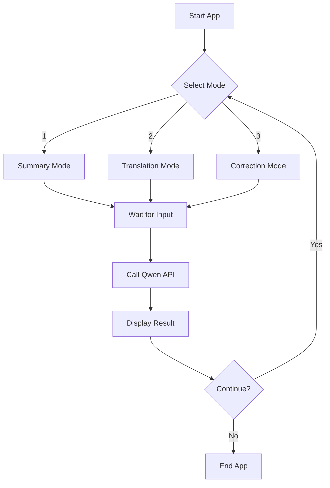

# Day 20：第一個完整 CLI 小工具 - AI 文本處理助手

## 🎯 學習目標
*   整合前 19 天所學：Python、NumPy (可選)、Qwen API、System Prompt、JSON。
*   實現一個具備多功能切換的命令行 (CLI) 應用。
*   學會如何管理代碼結構，不再只是「照著抄」，而是理解「為什麼這麼寫」。

---

## 📚 學習資源
*   **Python Click 庫 (選讀)**: [CLI for Python](https://click.palletsprojects.com/) (如果你想讓 CLI 更專業，這是神器)。
*   **DashScope 文檔**: [DashScope API Reference](https://help.aliyun.com/zh/dashscope/developer-reference/api-details)。

---

## 🛠️ 新手必會知識點 (附範例)

### 1. 模組化你的代碼 (Modularization)
不要把幾百行代碼塞在一個文件裡。學會將 API 調用封裝成一個函數或類。
```python
# ai_utils.py
def call_qwen(messages):
    # API logic here...
    return response

# main.py
from ai_utils import call_qwen
# Main logic here...
```

### 2. 錯誤處理 (Error Handling)
當 API 密鑰錯誤或網絡斷開時，你的程序不應該崩潰。
```python
try:
    response = call_qwen(messages)
except Exception as e:
    print(f"❌ Error occurred: {e}")
```

---

## 🧠 邏輯架構說明 (Mermaid 圖示)



---

## 💻 完整可運行範例：AI 多功能文本助手 (Qwen 版)
這是一個結構化、具備錯誤處理和人設切換的小工具。

```python
import os
import json
from dashscope import Generation
from http import HTTPStatus

# --- 1. Configuration & Utils ---
class AIProcessor:
    def __init__(self, api_key=None):
        # Prefer setting DASHSCOPE_API_KEY as an environment variable
        self.api_key = api_key or os.getenv("DASHSCOPE_API_KEY")
        if not self.api_key:
            raise ValueError("❌ Error: DashScope API Key is missing!")

    def call_qwen(self, system_prompt, user_content):
        messages = [
            {'role': 'system', 'content': system_prompt},
            {'role': 'user', 'content': user_content}
        ]
        
        response = Generation.call(
            model="qwen-turbo", # Turbo is fast and cheap for testing
            messages=messages,
            result_format='message',
        )
        
        if response.status_code == HTTPStatus.OK:
            return response.output.choices[0]['message']['content']
        else:
            return f"Error: {response.code} - {response.message}"

# --- 2. Main Logic ---
def main():
    processor = AIProcessor()
    
    modes = {
        "1": {"name": "📜 摘要生成", "prompt": "你是一個專業的文章摘要專家。請總結用戶提供的內容，並條列重點。"},
        "2": {"name": "🌐 翻譯專家", "prompt": "你是一個資深的翻譯專家。請將用戶輸入的內容翻譯成地道的英文。"},
        "3": {"name": "✍️ 語法校對", "prompt": "你是一個嚴謹的寫作老師。請修正用戶輸入中的語法錯誤，並給予改進建議。"}
    }
    
    print("\n" + "="*40)
    print("🚀 歡迎使用 AI 多功能文本助手 (Day 20)")
    print("="*40)
    
    while True:
        print("\n請選擇模式：")
        for k, v in modes.items():
            print(f"  {k}. {v['name']}")
        print("  Q. 退出程序")
        
        choice = input("\n👉 你的選擇: ").strip().upper()
        
        if choice == 'Q':
            print("再見！👋")
            break
            
        if choice not in modes:
            print("⚠️ 選擇無效，請重新輸入！")
            continue
            
        selected_mode = modes[choice]
        user_text = input(f"\n[{selected_mode['name']}] 請輸入待處理的文本: \n> ")
        
        print("\n⏳ AI 正在處理中...")
        result = processor.call_qwen(selected_mode['prompt'], user_text)
        
        print("\n" + "-"*30)
        print(f"✨ 處理結果:\n{result}")
        print("-"*30)

if __name__ == "__main__":
    try:
        main()
    except Exception as e:
        print(e)
```

---

## 💡 老師的建議 (必看)
1. **擺脫「照著抄」**：嘗試在 `modes` 字典中增加第 4 個模式，比如「情感分析」或「關鍵詞提取」，看看代碼邏輯是如何對應修改的。
2. **理解類 (Class) 的優點**：這裡我使用了 `AIProcessor` 類。這樣做的好處是，如果你以後想換成 OpenAI 或 Anthropic，你只需要修改這個類，主程序邏輯完全不用動。
3. **保持代碼整潔**：變量命名要清晰（如 `user_text` 而不是 `txt`），這會讓你在兩週後還能看懂自己的代碼。

---

## 📝 本日練習
1. 成功運行上面的代碼，並測試所有三種模式。
2. 增加一個功能：將處理結果保存到當前目錄下的一個名為 `ai_output.txt` 的文件中（追加保存，不要覆蓋）。
3. 挑戰：嘗試將 `Generation.call` 部分改為異步調用（參考 Day 19 的知識）。
    注意。因为Generation.call是一个同步方法，所以不能够简单用async / await修饰来让他变同步。
