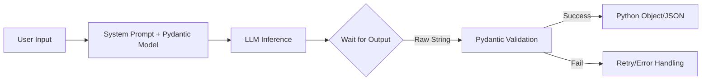

# Day 21：Structured Output (Pydantic) - 让 AI 输出稳定的 JSON

## 🎯 学习目标
*   学习如何使用 `Pydantic` 库定义数据模型。
*   掌握如何强制 AI 按照指定的 JSON 结构返回结果。
*   理解结构化输出在实际 AI 应用中的重要性（例如：自动填表、数据库入库）。

---

## 📚 学习资源
*   **Pydantic 官方文档**: [Pydantic Getting Started](https://docs.pydantic.dev/latest/)
*   **通义千问结构化输出说明**: [DashScope JSON 模式](https://help.aliyun.com/zh/dashscope/developer-reference/api-details)

---

## 🛠️ 新手必会知识点 (附例子)

### 1. 为什么需要结构化输出？
如果不使用结构化输出，AI 可能返回：
*   `"这是你要的 JSON：{"name": "Alice"}"` (带有额外多余文字)
*   `{"name": "Alice", "age": "twenty"}` (数据类型错误)

### 2. 使用 Pydantic 定义模型
```python
from pydantic import BaseModel, Field
from typing import List

class UserInfo(BaseModel):
    name: str = Field(description="The user's full name")
    age: int = Field(description="The user's age in years")
    hobbies: List[str] = Field(default=[], description="A list of the user's hobbies")

# 验证数据
user = UserInfo(name="Alice", age=25, hobbies=["Reading", "Coding"])
print(user.json()) # 自动转换成标准 JSON
```

---

## 🧠 逻辑架构说明 (Mermaid 图示)



---

## 💻 完整可运行范例：自动简历提取器

### JSON、JSON Schema、字典 三者使用pydantic转换

```python
import json
from pydantic import BaseModel, Field
from typing import List

# ============================================
# 1. 字典 (dict) - Python 内存对象
# ============================================
my_dict = {
    "name": "张三",
    "age": 25,
    "skills": ["Python", "SQL"]
}

# ============================================
# 2. JSON - 字符串格式（用于传输/存储）
# ============================================
json_string = '{"name": "张三", "age": 25, "skills": ["Python", "SQL"]}'

# 字典和 JSON 可以互相转换
dict_to_json = json.dumps(my_dict)  # 字典 → JSON字符串
json_to_dict = json.loads(json_string)  # JSON字符串 → 字典

# ============================================
# 3. JSON Schema - 描述数据结构的规范（也是字符串）
# ============================================
# 定义模型
class Person(BaseModel):
    name: str = Field(..., description="姓名")
    age: int = Field(..., ge=0, le=150, description="年龄")
    skills: List[str] = Field(default_factory=list)

# 生成 JSON Schema（是一个字典对象）
schema_dict = Person.schema()

# JSON Schema 也可以转成 JSON 字符串
schema_json_string = Person.schema_json()
```

结果区别

```python
# 字典:
# 类型: <class 'dict'>
# 内容: {'name': '张三', 'age': 25, 'skills': ['Python', 'SQL']}

# JSON:
# 类型: <class 'str'>
# 内容: {"name": "张三", "age": 25, "skills": ["Python", "SQL"]}

# JSON Schema (字典):
# 类型: <class 'dict'>
# 内容: {
#   "title": "Person",
#   "type": "object",
#   "properties": {
#     "name": {
#       "title": "Name",
#       "description": "姓名",
#       "type": "string"
#     },
#     "age": {
#       "title": "Age",
#       "description": "年龄",
#       "type": "integer",
#       "minimum": 0,
#       "maximum": 150
#     },
#     "skills": {
#       "title": "Skills",
#       "type": "array",
#       "items": {"type": "string"}
#     }
#   },
#   "required": ["name", "age"]
# }
```


| 概念 | 是什么 | 类型 | 用途 | 示例 |
|------|--------|------|------|------|
| **字典 (dict)** | Python 数据对象 | `dict` | 程序内部操作 | `{"name": "张三"}` |
| **JSON** | 数据交换格式 | `str` | API传输、文件存储 | `'{"name": "张三"}'` |
| **JSON Schema** | 数据结构定义 | `str` 或 `dict` | 验证数据、生成文档 | 描述 `name` 必须是字符串 |

**关键理解**：
1. JSON 是**字符串**，不是对象
2. JSON Schema 也是字符串（或字典），但它**描述规则**，不是实际数据


### 案例所用到的语法
* `pydantic` `Feild`的用法。
    ```py
    class Example(BaseModel):
        # 方式A：直接类型注解（必填，无额外配置）
        name1: str
        
        # 方式B：Field(...)（必填，可添加 description、验证规则等）
        name2: str = Field(..., description="这是姓名")
        
        # 方式C：Field(默认值)（可选，有默认值）
        name3: str = Field("匿名", description="默认是匿名")
    ```
* `.schema_json()`生成json
* `parse_raw(str)`- 从 JSON 字符串解析

🌰 将一段非结构化的自我介绍文本变成整齐的 Python 对象。

```python
import os
import json
from pydantic import BaseModel, Field
from typing import List, Optional
from dashscope import Generation
from http import HTTPStatus

# 1. 定义我们想要的数据结构
class Resume(BaseModel):
    name: str = Field(..., description="姓名")
    years_of_experience: int = Field(..., description="工作年限")
    skills: List[str] = Field(..., description="核心技能列表")
    education: Optional[str] = Field(None, description="最高学历")

# 2. 调用 Qwen 提取数据
def extract_resume_info(text: str):
    # 构造 Prompt，要求 AI 严格按 JSON 格式返回
    prompt = f"""
    请从以下文本中提取简历信息，并仅以 JSON 格式返回。
    文本内容：{text}
    JSON 结构示例：{Resume.schema_json()}
    """
    
    messages = [
        {'role': 'system', 'content': '你是一个专业的人事简历分析师。'},
        {'role': 'user', 'content': prompt}
    ]
    
    response = Generation.call(
        model="qwen-turbo",
        messages=messages,
        result_format='message',
    )
    
    if response.status_code == HTTPStatus.OK:
        content = response.output.choices[0]['message']['content']
        # 清洗可能存在的 ```json 代码块标记
        clean_content = content.replace("```json", "").replace("```", "").strip()
        
        # 3. 使用 Pydantic 进行校验转换
        try:
            resume_data = Resume.parse_raw(clean_content)
            return resume_data
        except Exception as e:
            return f"数据校验失败：{e}"
    else:
        return f"API 调用失败：{response.message}"

# --- Main ---
if __name__ == "__main__":
    raw_text = "我叫张三，在 IT 行业摸爬滚打 5 年了。精通 Python、Docker 和 Kubernetes。本科毕业于清华大学。"
    print("⏳ 正在分析文本...")
    result = extract_resume_info(raw_text)
    
    if isinstance(result, Resume):
        print("\n✅ 提取成功：")
        print(f"姓名: {result.name}")
        print(f"年限: {result.years_of_experience}")
        print(f"技能: {', '.join(result.skills)}")
        print(f"学历: {result.education}")
    else:
        print(result)
```

---

## 💡 老师的建议 (必看)
1. **Pydantic 是核心**：它是目前 Python AI 开发中最流行的库（LangChain 和 FastAPI 都在用它）。一定要掌握 `Field` 的用法。
2. **处理“幻觉”**：AI 有时会多吐一些废话（比如“好的，这是你要的结果”），记得在代码里用 `.replace()` 或正则清洗一下，再传给 Pydantic。
3. **免费额度**：通义千问 Qwen-Turbo 现在有很大的免费额度，非常适合练手。

---

## 📝 本日练习
1. 修改 `Resume` 模型，增加一个 `email` 字段，并尝试提取包含邮箱的文本。
2. 思考：如果 `raw_text` 里完全没写工作年限，代码会报错吗？该如何给 `years_of_experience` 设置默认值？
