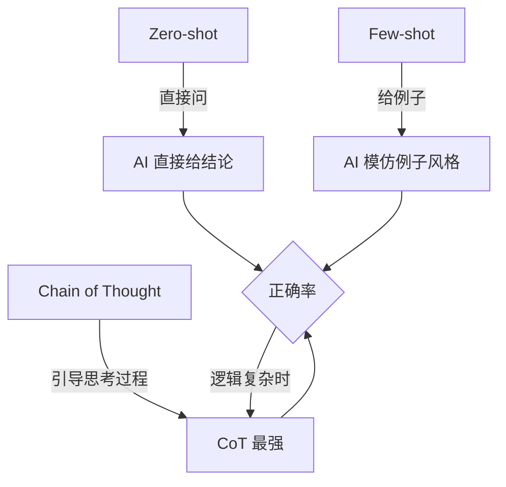

# Day 23：Prompt Engineering (提示工程高级技巧) - Few-shot 与 CoT

## 🎯 学习目标

- 学习 **Few-shot Prompting (少量样本提示)**：通过给 AI 几个例子，教会它某种特定的任务。
- 掌握 **Chain of Thought (CoT, 思维链)**：引导 AI 逐步思考，解决逻辑复杂的推理问题。
- 理解 **System Prompt vs User Prompt** 的分工。
- 掌握如何通过 Prompt 防止 AI 的幻觉 (Hallucination)。

---

## 📚 学习资源

- **Prompt Engineering Guide (必看)**: [PromptingGuide.ai 中文版](https://www.promptingguide.ai/zh)
- **OpenAI Best Practices**: [Prompt Engineering Techniques](https://platform.openai.com/docs/guides/prompt-engineering)

---

## 🛠️ 新手必会知识点 (附例子)

### 1. Few-shot (少样本)

当你希望 AI 以特定的格式或风格回复时，直接给它几个例子是最高效的。

```text
# 错误的 Prompt:
"帮我把中文翻译成地道的法语。"

# Few-shot Prompt:
"你是一个法语专家。请参考以下例子进行翻译：
中文：你好吗？ -> 法语：Comment ça va?
中文：天气不错。 -> 法语：Il fait beau.
中文：我想喝咖啡。 -> 法语："
```

### 2. Chain of Thought (思维链)

对于逻辑推理、数学计算或复杂决策，要求 AI “一步步思考”。

- **提示词技巧**：`"Let's think step by step."` (让我们一步步思考) 或 `"请列出你的分析逻辑，最后给出结论。"`

---

## 🧠 逻辑架构说明 (Mermaid 图示)



---

## 💻 完整可运行范例：逻辑推理专家 (CoT + Few-shot)

这个例子展示了如何通过 Prompt 让 AI 解决一个复杂的谜题。

```python
import os
from dashscope import Generation
from http import HTTPStatus

def solve_complex_problem(question):
    # 构造带有 CoT 引导和特定风格的 Prompt
    system_prompt = (
        "你是一个逻辑严密的数学家和推理专家。"
        "当你面对问题时，必须遵循以下步骤：\n"
        "1. 提取题目中的核心已知条件。\n"
        "2. 列出中间推导过程。\n"
        "3. 给出最终结论。\n"
        "请确保逻辑严丝合缝。"
    )

    # 这是一个 Zero-shot 例子，加上了 CoT 的指令引导
    user_prompt = f"问题是：{question}\n请一步步思考并给出详细解答。"

    messages = [
        {'role': 'system', 'content': system_prompt},
        {'role': 'user', 'content': user_prompt}
    ]

    response = Generation.call(
        model="qwen-max",
        messages=messages,
        result_format='message'
    )

    if response.status_code == HTTPStatus.OK:
        return response.output.choices[0]['message']['content']
    else:
        return f"Error: {response.message}"

# --- Main ---
if __name__ == "__main__":
    # 这是一个经典的逻辑谜题
    puzzle = (
        "桌上有 3 个箱子，一个装苹果，一个装橘子，一个装苹果和橘子的混合。所有标签都是错的。"
        "如果你只能从一个标有'混合'的箱子里拿出一个水果，你该如何给所有箱子重新贴标？"
    )

    print("⏳ AI 专家正在深度思考中...")
    solution = solve_complex_problem(puzzle)

    print("\n" + "="*30)
    print("✨ AI 推理过程与结论：")
    print(solution)
    print("="*30)
```

---

## 💡 老师的建议 (必看)

1. **好的 Prompt 等于好的代码注释**：尽量用清晰、无歧义的语言描述。
2. **结构化 Prompt**：使用 `#`, `---`, `1. 2. 3.` 这样的符号来分割 Prompt 里的不同部分，能有效提高 AI 的理解能力。
3. **防止幻觉**：在 Prompt 结尾加上 `"如果你不知道答案，请诚实回答不知道，不要胡乱猜测。"`

---

## 📝 本日练习

1. 修改上面的代码，实现一个 **Few-shot 翻译器**：给 AI 3 个把中国成语翻译成地道英语俚语的例子，然后让它翻译「画蛇添足」。

```py
# 作业：批改之前
prompt = """
你是一个精通中国成语的文学家和英文翻译专家，能够识别成语寓意并进行准确翻译。翻译中国成语时，关键在于传达其比喻义而非字面意思。由于英语中没有完全对应的表达，通常采用以下策略：意译（解释核心寓意）或使用英语习语（找到功能相似的表达）。

案例：
    1.如虎添翼
    直译：To draw a snake and add feet to it
    意译：
    to ruin something by adding unnecessary details
    to overdo something and spoil it
    2. 照猫画虎
    直译：To draw a tiger by copying a cat
    意译：
    to imitate something poorly without understanding the essence
    to produce a crude or clumsy copy
    3.对牛弹琴
    直译：To play a lute to a cow
    意译：
    to explain something to someone who cannot understand it
    to waste one's words on an unappreciative audience

文本： 画蛇添足

"""
```
### 当前存在的问题：

1.案例**格式**没有统一
意译有时多条，有时像列表
2.AI 可能不知道你想要的最终输出格式
是只输出意译？还是直译+意译+习语？
3.没有用符号明确分隔「原则」「案例」「任务」
```py
# 改进之后
prompt="""
# 角色
你是一个精通中国成语的文学家和英文翻译专家。

# 翻译原则
- 优先传达比喻义，而非字面意思
- 可选用：意译 / 英语习语
- 不强行直译

# 案例（Few-shot）

## 案例1：如虎添翼
- 直译：Like a tiger that has grown wings
- 意译：to add to one's strength
- 习语：a shot in the arm

## 案例2：照猫画虎
- 直译：To draw a tiger by copying a cat
- 意译：to imitate something poorly
- 习语：a poor / pale copy

## 案例3：对牛弹琴
- 直译：To play a lute to a cow
- 意译：to waste one's words
- 习语：cast pearls before swine

# 现在请翻译以下成语（按相同格式输出）

成语：画蛇添足
"""
```

2. 尝试不给 AI 发送 `Step by Step` 的引导，看看它的回复质量是否有下降。
3. 思考：为什么说 Prompt Engineering 是 AI 程序员的「基本功」？
   - 答案：因为 Prompt 质量直接决定了下游 Python 代码解析数据的稳定性。
