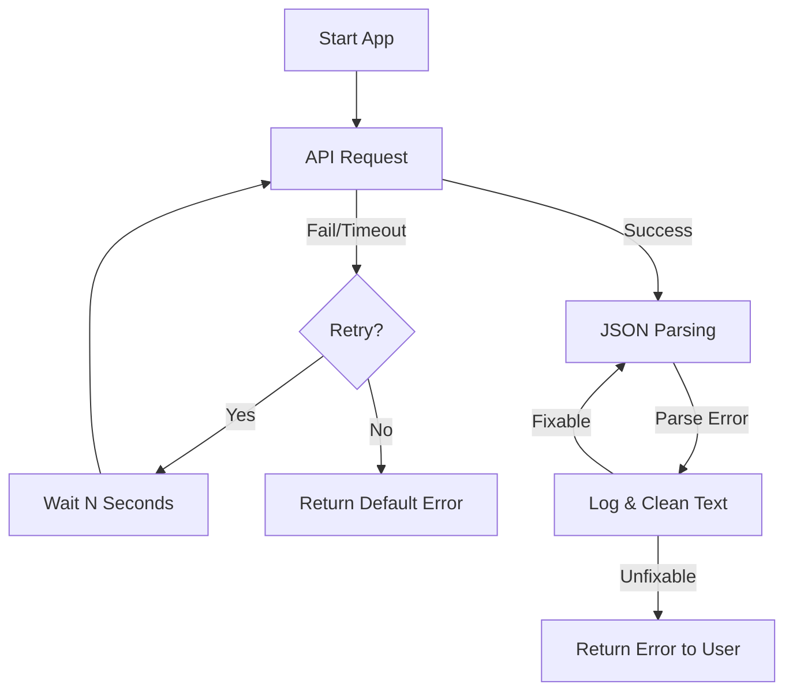

# Day 25：复习与 Debug 日 - 解决 AI 代码中的常见报错

## 🎯 学习目标
*   复习 Day 17-24 的核心知识点（NumPy, API 调用, JSON 解析, Pydantic, Function Calling）。
*   学会识别并解决 AI 开发中的常见错误（如 `JSONDecodeError`, `API Timeout`, `Token Limit Exceeded`）。
*   掌握如何给代码增加健壮性（Robustness），让程序不仅能跑，还能“抗造”。

---

## 📚 学习资源
*   **Python 异常处理**: [Errors and Exceptions](https://docs.python.org/3/tutorial/errors.html)
*   **DashScope 错误代码对照表**: [阿里错误代码查询](https://help.aliyun.com/zh/dashscope/developer-reference/error-code)

---

## 🛠️ 新手必会知识点 (附例子)

### 1. 结构化输出的异常捕捉 (Pydantic Retry)
当  `parse_raw`例子，当ai_output格式不对不能够被parse时候会被抓到
```python
try:
    data = MyModel.parse_raw(ai_output)
except Exception as e:
    # 策略 1：重试一遍，并在 Prompt 里强调“必须是合法 JSON”
    # 策略 2：记录日志，返回默认值
    print(f"❌ 解析失败: {e}")
```

### 2. API 超时与指数退避 (Exponential Backoff)
网络总是不稳定的。如果 API 没响应，不要立刻连续重试，要等 1秒、2秒、4秒...
这里进入`except Exception as e`的时候没有break就会再次进入for循环，最多三次
```python
import time
for i in range(3):
    try:
        # Call API...
        break
    except Exception as e:
        time.sleep(2**i) # 2^0=1s, 2^1=2s, 2^2=4s
```

---

## 🧠 逻辑架构说明 (Mermaid 图示)



---

## 💻 完整可运行范例：具备错误重试机制的 AI 工具
[这个例子](./exercise.py)展示了如何处理最烦人的 `JSONDecodeError`。


## 例子相关知识点、

### HTTP状态码分类与常见状态码

| 状态码 | 类型 | 含义 | 你的代码该怎么做 |
|--------|------|------|------------------|
| **200** | ✅ 成功 | 一切正常，返回请求的资源 | 正常处理数据 |
| **400** | ❌ 客户端错误 | 请求参数格式错误、JSON解析失败 | 检查请求参数，不要重试（重试也没用） |
| **401** | ❌ 未认证 | Token过期、未登录 | 重新获取Token/引导用户登录 |
| **403** | ❌ 无权限 | 已认证但无权访问该资源 | 提示用户权限不足 |
| **404** | ❌ 资源不存在 | URL错误、资源已被删除 | 检查URL是否正确 |
| **429** | ⚠️ 限流 | 请求太频繁，触发频率限制 | **需要等待后重试，适合用指数退避** |
| **500** | ⚠️ 服务器错误 | 服务器内部异常 | 可以重试（可能是临时问题） |
| **502/504** | ⚠️ 网关错误 | 上游服务挂了或超时 | 可以重试 |
| **503** | ⚠️ 服务不可用 | 服务器过载或维护中 | 可以重试，检查Retry-After头 |

---

### 通义千问等大模型API的状态码

**通义千问的HTTP状态码和通用标准是一致的**，都遵循HTTP协议规范。不过它的错误响应里会包含更细粒度业务错误码：

**通义千问常见HTTP状态码**：

| HTTP状态码 | 业务错误码示例 | 含义 | 处理方式 |
|-----------|---------------|------|----------|
| 400 | InvalidParameter | 参数类型或字段不符合规范 | 检查参数，不重试 |
| 400 | ParamValue.Error | 参数值业务校验失败 | 检查参数值 |
| 400 | ProcessTimeout.Error | 执行超时 | 可重试 |
| 404 | NotFound / RequestPath.NotFound | 资源/接口不存在 | 检查URL和配置 |
| 401 | access_denied | **API密钥无效**或权限不足 | 检查API Key |
| 429 | rate_limited | 超出调用频率限制 | **指数退避重试** |
| 500 | InternalError | 系统内部未知异常 | 可重试 |

**总结：大模型API的HTTP状态码和其他API没区别，都是标准协议。区别在于错误响应体里的`code`字段（如`InvalidParameter`），这是每个厂商自定义的。**

---

### 日常开发中如何整理状态码？

建议你按这样组织代码：

```python
# 常量定义，集中管理
class HTTPStatus:
    OK = 200
    BAD_REQUEST = 400
    UNAUTHORIZED = 401
    FORBIDDEN = 403
    NOT_FOUND = 404
    TOO_MANY_REQUESTS = 429
    INTERNAL_SERVER_ERROR = 500
    BAD_GATEWAY = 502
    SERVICE_UNAVAILABLE = 503
    
# 区分哪些错误需要重试
RETRYABLE_STATUSES = {
    HTTPStatus.TOO_MANY_REQUESTS,
    HTTPStatus.INTERNAL_SERVER_ERROR,
    HTTPStatus.BAD_GATEWAY,
    HTTPStatus.SERVICE_UNAVAILABLE,
}

# 业务代码中使用
if response.status_code in RETRYABLE_STATUSES:
    # 执行重试逻辑
    pass
```


---

## 💡 老师的建议 (必看)
1. **别被报错吓跑**：当你的代码报错 `AttributeError` 或 `KeyError` 时，最好的办法是打印出当前的变量（使用 `print(dir(obj))` 或 `print(type(obj))`），看看 AI 到底回了什么。
2. **日志 (Logging)**：在真实项目中，不要只用 `print`，要学习使用 Python 的 `logging` 库，把错误记录到文件里，方便复盘。
3. **环境检查**：如果你在代码里用了 `os.getenv("DASHSCOPE_API_KEY")`，请确保你已经在终端执行了 `export DASHSCOPE_API_KEY=xxx`。

---

## 📝 本日练习
1. 回顾你 Day 17-24 写过的所有代码，看看哪些地方没有加 `try-except`，动手补上。
2. 故意改错你的 API Key，观察程序会报什么错，你的代码能否优雅地处理它（而不是直接崩掉）。
3. 复习 NumPy：创建一个 (3, 3) 的随机数矩阵，并计算它的均值。
    *(答案参考：`np.random.rand(3,3).mean()`) *
    