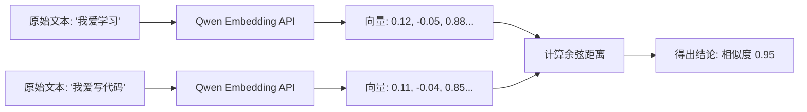

# Day 26：Embedding (嵌入) 原理与 Qwen Embedding API

## 🎯 学习目标
*   理解什么是 **Embedding**：将文字转化为向量（一串数字）的过程。
*   掌握向量的**维度**和**语义空间**概念（为什么相似的词向量也接近？）。
*   学会调用通义千问 (Qwen) 的 Embedding 接口。
*   能够对比不同文本之间的向量距离。

---

## 📚 学习资源
*   **通义千问 Embedding API 文档**: [DashScope 文本向量接口](https://help.aliyun.com/zh/dashscope/developer-reference/text-embedding-api-details)
*   **可视化 Embedding (必看)**: [Projector.tensorflow.org](https://projector.tensorflow.org/) (直观感受向量空间)
*   **What are Embeddings? (视频/博文)**: [OpenAI Embeddings Guide](https://developers.openai.com/api/docs/guides/embeddings)

---

## 🛠️ 新手必会知识点 (附例子)

### 1. 向量化 (Vectorization)
想象一下，“猫”和“狗”在空间中离得很近，而“手机”离它们很远。Embedding 就是给每个词定一个“坐标”。
*   **维度**：Qwen 的文本向量通常是 1536 或 1024 维。意味着每个词由 1536 个数字组成。

### 2. 余弦相似度 (Cosine Similarity)
我们在 Day 17 学过 NumPy 计算相似度。今天我们将用真实模型的向量来计算。
*   值越接近 **1**，语义越相似。
*   值越接近 **0**，语义越不相关。

---

## 🧠 逻辑架构说明 (Mermaid 图示)



---

## 💻 完整可运行范例：文本语义查重助手
使用真实的 Qwen Embedding API 来比较两段话的意思是否接近。

```python
import os
from dashscope import TextEmbedding
from http import HTTPStatus
import numpy as np

# 1. 封装获取向量的函数，
# 这个方法这里返回的是python列表
def get_embedding(text):
    """
    调用 Qwen API 获取文本向量
    """
    response = TextEmbedding.call(
        model=TextEmbedding.Models.text_embedding_v2,
        input=text
    )
    if response.status_code == HTTPStatus.OK:
        # 返回第一个文本的向量
        return response.output['embeddings'][0]['embedding']
    else:
        raise Exception(f"API Error: {response.message}")

# 2. 计算余弦相似度 (复用 Day 17 知识)
# 要把python列表转化成nparray方便计算
def cosine_similarity(v1, v2):
    v1, v2 = np.array(v1), np.array(v2)
    return np.dot(v1, v2) / (np.linalg.norm(v1) * np.linalg.norm(v2))

# --- Main ---
if __name__ == "__main__":
    # 请确保已设置环境变量 DASHSCOPE_API_KEY
    try:
        text1 = "人工智能正在改变世界。"
        text2 = "AI 技术对人类社会产生了巨大影响。"
        text3 = "今天晚饭我想吃红烧肉。"

        print("⏳ 正在获取向量...")
        vec1 = get_embedding(text1)
        vec2 = get_embedding(text2)
        vec3 = get_embedding(text3)

        sim12 = cosine_similarity(vec1, vec2)
        sim13 = cosine_similarity(vec1, vec3)

        print(f"\n📄 句子 1: {text1}")
        print(f"📄 句子 2: {text2}")
        print(f"📄 句子 3: {text3}")
        print("-" * 30)
        print(f"✨ 句子 1 与 2 的相似度: {sim12:.4f} (语义接近)")
        print(f"✨ 句子 1 与 3 的相似度: {sim13:.4f} (语义无关)")

    except Exception as e:
        print(f"❌ 运行失败: {e}")
```

---

## 💡 老师的建议 (必看)
1.  **省钱技巧**：Embedding 的 Token 非常便宜（比 Chat 便宜得多），但在大规模处理文档时，建议先将向量**缓存到本地**，不要重复调用同一个句子的 API。
2.  **模型选择**：Qwen 的 `text-embedding-v2` 是目前中文表现非常好的模型，优先使用它。
3.  **准备工作**：如果你还没有注册通义千问，请务必在今天完成注册并拿到 API Key。

---

## 📝 本日练习
1.  输入 5 段不同的新闻标题，编写代码找出其中“意思最接近”的两条。
2.  思考：为什么“没吃饭”和“饿了”这两个词在字面上没有共同点，但它们的 Embedding 相似度很高？
3.  挑战：将一段 2000 字的长文章直接传给 Embedding 接口，看看会发生什么？（提示：注意 **Token 限制**）。
