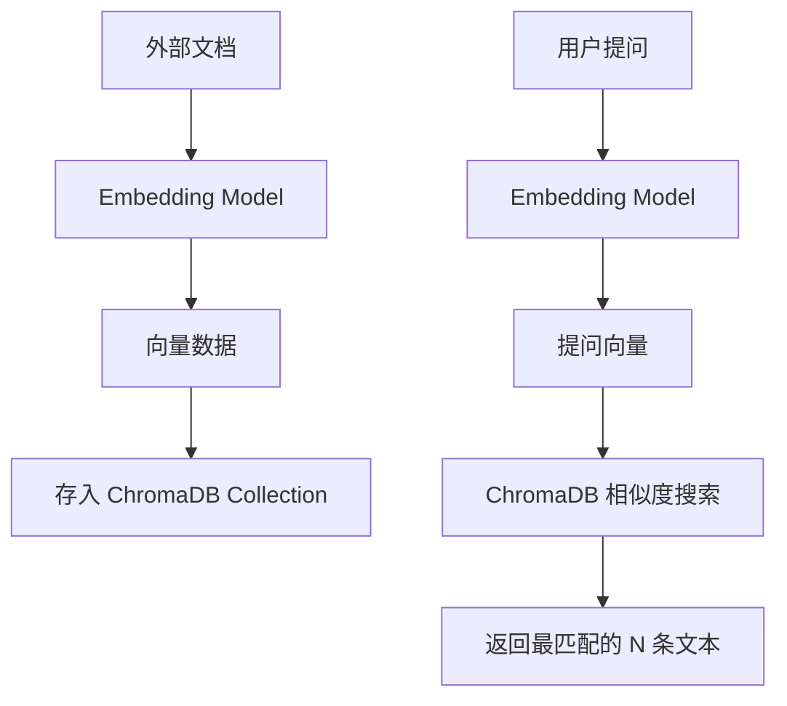

# Day 27：向量数据库基础 - ChromaDB 使用手册

## 🎯 学习目标
*   理解什么是 **向量数据库 (Vector Database)**：专门存 Embedding 的数据库。
*   学会安装并使用 **ChromaDB**（目前最轻量、适合新手的向量数据库）。
*   掌握数据库的核心操作：**增 (Add)**、**查 (Query)**、**删 (Delete)**。
*   理解索引 (Index) 和集合 (Collection) 的概念。

---

## 📚 学习资源
*   **ChromaDB 官方文档 (必读)**: [ChromaDB Quickstart](https://docs.trychroma.com/docs/overview/getting-started)
*   **Vector DB 基础概念**: [Pinecone Learn: Vector Databases](https://www.pinecone.io/learn/vector-database/) (虽然这是竞品的，但原理通通用)
*   **ChromaDB Python SDK**: [GitHub Repo](https://github.com/chroma-core/chroma)

---

## 🛠️ 新手必会知识点 (附例子)

### 1. 为什么不用传统数据库 (如 MySQL)？
*   **MySQL**: 查 `WHERE name='Alice'` (精确查找)。
*   **Vector DB**: 查 `与 [0.1, 0.2...] 语义最接近的 5 条数据` (近似搜索，ANN - Approximate Nearest Neighbor)。

### 2. 集合 (Collection)
相当于关系型数据库里的 **表 (Table)**。
```python
import chromadb

client = chromadb.Client() # 初始化客户端
collection = client.create_collection(name="my_documents") # 创建一个名为 my_documents 的表

# 获取或创建（推荐，避免重复创建报错）
collection = client.get_or_create_collection("products")

# 查看所有集合
collections = client.list_collections()
print([c.name for c in collections])

# 删除集合
client.delete_collection("products")

# 查看集合中数据条数
count = collection.count()
print(f"共有 {count} 条数据")

# 查看前几条数据
first_10 = collection.peek()
print(first_10)
```

#### 在集合中添加数据 `collection.add()`
```python
collection.add(
    ids=["id1", "id2"]
    # 方式1：只传文档（自动生成向量）
    documents=["文本1", "文本2"],
    # 方式2：加上metadatas就是同时传文档和元数据
    metadatas=[{"brand": "Apple"}, {"brand": "Huawei"}],
    # 方式3：手动传入向量（如果你有自己的嵌入模型）
    embeddings=[[0.1, 0.2, ...], [0.3, 0.4, ...]],  # 768维向量
)

```

### 更新和删除数据
```python
# 更新数据（ID必须存在）
collection.update(
    ids=["doc1"],
    documents=["更新后的内容"],
    metadatas=[{"category": "已更新"}]
)

# 删除数据
collection.delete(ids=["doc2"])

# 批量删除
collection.delete(ids=["id1", "id2", "id3"])
```

### 3. 持久化 (Persistence)
默认 ChromaDB 存在内存里（关机即消失）。在正式项目中，我们需要把它存到硬盘上。
```python
# 存到本地目录 ./chroma_db
client = chromadb.PersistentClient(path="./chroma_db") 
```

### 数据查询 collection.query
```python
results=collection.query(
    query_texts=['搜索关键词']，
    n_results=5

    # 按照向量查询
    query_embeddngs=[[0.2,0.4...]]

    # 按照id获取批量数据。include用来控制返回那些字段
    ids=['doc1','doc3'],
    include=['documents','metadatas'] 
)

```

### 最实用的功能 --- **元数据过滤**（where）
注意过滤也可以和query_text组合查询
```python
# 精确匹配
results = collection.query(
    query_texts=["学生信息"],
    where={"source": "student info"},  # 只搜索 source=student info 的数据
    # 又或者
    # where={"price": {"$lt": 5000}},  # 价格小于5000
    # 还能用where_document 做文档内容过滤
    # where_document={"$contains": "神经网络"},
    n_results=3
)

# 支持的操作符
# $eq - 等于（默认）
# $ne - 不等于
# $gt - 大于
# $gte - 大于等于
# $lt - 小于
# $lte - 小于等于
```


---

## 🧠 逻辑架构说明 (Mermaid 图示)



---

## 💻 完整可运行范例：简易本地知识库存储与搜索
我们将手动把几条“冷知识”存入数据库，然后通过提问搜出它们。

```python
import chromadb
import uuid # 生成唯一 ID

# 1. 初始化持久化客户端（数据会存在本地 chroma_data 文件夹）
client = chromadb.PersistentClient(path="./chroma_data")

# 2. 创建或获取一个集合 (Collection)
# 注意：这里我们让 ChromaDB 默认使用内置的 Embedding 函数 (通常是 SentenceTransformer)
# 后面我们会学习如何结合通义千问的 Embedding
collection = client.get_or_create_collection(name="cool_facts")

# 3. 准备几条冷知识数据
documents = [
    "企鹅其实是有脖子的，只是被羽毛盖住了。",
    "章鱼有三颗心脏，血液是蓝色的。",
    "在太空中，宇航员其实长得更高，因为脊椎不再受重力压缩。",
    "香蕉在植物学上其实被定义为浆果，而草莓却不是。"
]
ids = [str(uuid.uuid4()) for _ in documents] # 为每条数据生成唯一 ID

# 4. 存入数据库 (Add)
print("⏳ 正在存入数据到向量数据库...")
collection.add(
    documents=documents,
    ids=ids
)
print("✅ 存入完成！")

# 5. 进行语义查询 (Query)
def search_facts(query_text):
    print(f"\n🔍 搜索问题: {query_text}")
    results = collection.query(
        query_texts=[query_text],
        n_results=2 # 返回最接近的前 2 条
    )
    
    # 打印结果
    print("✨ AI 找到的最相关知识点：")
    for doc in results['documents'][0]:
        print(f" - {doc}")

# --- Main ---
if __name__ == "__main__":
    search_facts("关于海洋生物的冷知识？")
    search_facts("人去外星球会变高吗？")
```


---

## 💡 老师的建议 (必看)
1.  **ChromaDB 的轻量化**：它不需要像 MySQL 一样安装复杂的服务器，直接 `pip install chromadb` 就能用。非常适合个人项目。
2.  **ID 很重要**：在存入数据时，`ids` 是必填项。建议使用 `uuid` 库来生成，防止重复。
3.  **注意版本**：ChromaDB 更新很快，如果代码报错，请先检查 `pip show chromadb` 的版本是否太旧。

---

## 📝 本日练习


```python
import chromadb

# 创建客户端方式1直接Client，内存模式，数据没有持久化
# client = chromadb.Client()
# 方式2 存在本地PersistentClient
client = chromadb.PersistentClient(path="./chroma_db") 

# 2. 创建集合（类似于创建表）
collection = clienet.create_collection(
    name='first_collection'
)


#3.添加文档
collection.add(
    documents=[
        '中山的地标性美食有大煎堆，烤乳鸽和脆肉皖鱼',
        '佛山的糖水很出名',
        '江西的辣椒在全国范围公认是最辣的'
    ],
    # Metadata	列/标签	用于过滤的附加信息
    metadatas=[
        {"category": "中山", "source": "wiki"},
        {"category": "佛山", "source": "百科"},
        {"category": "江西", "source": "博客"}
    ],
    # IDs（唯一标识）
    ids=['doc1','doc2','doc3']
)

print(f'数据总共有{collection.count()条}')


#4.查询
results=collection.query(
    query_texts=['哪里的乳鸽最好吃'],
    n_results=2 #返回数据最相似的2条结果
)

#5.查看结果
# 📒 enumerate(iterable, start=0) python内置函数，便利列表的时候获取索引和值
#   iterable为可迭代对象
print('\n查看结果：')
for i,doc in enumerate(results['documents'][0]):
    print(f"{i+1}-{doc}")
    print(f"分类：{results['metadatas'][0][i]['category']}")
    # 这个相似度越小代表越相似（算得是cos距离）
    print(f"相似度分数: {results['distances'][0][i]}\n")
```
