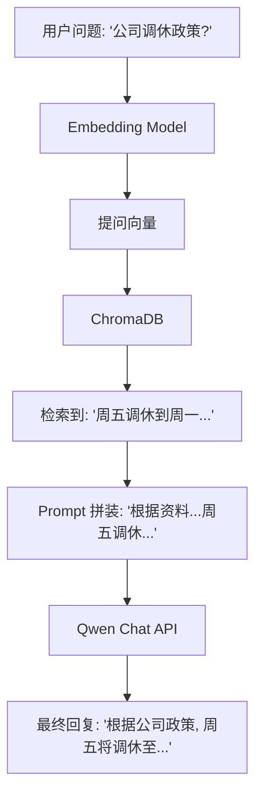

# Day 28：RAG 完整流程手工实现 (不使用框架)

## 🎯 学习目标
*   整合 **Qwen Chat API** + **Qwen Embedding API** + **ChromaDB**。
*   理解 **RAG (Retrieval-Augmented Generation)** 的完整闭环：检索 -> 注入 -> 生成。
*   不依赖 LangChain 或 LlamaIndex，纯手工实现 RAG。
*   掌握 **Prompt 注入** 的技巧（如何让 AI 根据知识库回答）。

---

## 📚 学习资源
*   **RAG 核心论文 (了解)**: [Retrieval-Augmented Generation for Knowledge-Intensive NLP Tasks](https://arxiv.org/abs/2005.11401)
*   **Pinecone RAG Tutorial**: [RAG Explained Step-by-Step](https://www.pinecone.io/learn/retrieval-augmented-generation/)
*   **通义千问 RAG 开发指南**: [阿里云 RAG 实践手册](https://help.aliyun.com/zh/dashscope/use-cases/rag-tutorial)

---


## 🛠️ 新手必会知识点 (附例子)

### 1. 检索 (Retrieval)
从向量数据库中找最相关的几句话。
```python
results = collection.query(query_texts=["用户问题"], n_results=3)
context = "\n".join(results['documents'][0]) # 将检索出来的知识合并成一段话
```

### 2. 注入 (Augmentation)
将这些知识塞进 System Prompt。
```python
system_prompt = f"""
你是一个专业的知识助手。请根据以下参考资料回答用户问题。
参考资料：
{context}

注意：如果参考资料里没写，请诚实回答“我不知道”，不要胡编乱造。
"""
```

### 3. 生成 (Generation)
让 AI 根据带知识的 Prompt 给出最终回答。

---

## 🧠 逻辑架构说明 (Mermaid 图示)



---

## 💻 完整可运行范例：私人文档问答助手 (手工版)
这一个脚本包含了 RAG 的所有步骤：加载 -> 存入向量库 -> 检索 -> AI 回答。

```python
import os
import chromadb
from dashscope import Generation, TextEmbedding
from http import HTTPStatus

# 1. 模拟 Qwen Embedding 函数 (适配 ChromaDB)
def get_qwen_embedding(text):
    response = TextEmbedding.call(
        model=TextEmbedding.Models.text_embedding_v2,
        input=text
    )
    return response.output['embeddings'][0]['embedding']

# 2. 模拟知识库数据 (通常是从 PDF/TXT 读取)
PRIVATE_KNOWLEDGE = [
    "Cursor 公司成立于 2022 年，总部位于旧金山。",
    "Cursor 的首席执行官是 Michael Truell。",
    "Cursor 的核心产品是基于 AI 的代码编辑器，集成了 Claude 和 GPT 模型。",
    "Cursor 的口号是：让编程更简单。"
]

def main_rag():
    # --- 步骤 A: 准备向量数据库 ---
    client = chromadb.Client() # 内存模式
    collection = client.create_collection(name="cursor_wiki")
    
    print("⏳ 正在为知识库建立索引...")
    for i, text in enumerate(PRIVATE_KNOWLEDGE):
        # 手动调用 Qwen 获取向量
        vec = get_qwen_embedding(text)
        collection.add(
            embeddings=[vec], # 存入我们自己算的向量
            documents=[text],
            ids=[f"id_{i}"]
        )
    print("✅ 知识库就绪！")

    # --- 步骤 B: 用户提问 ---
    user_query = "Cursor 公司是谁创办的？总部在哪？"
    print(f"\n👤 用户提问: {user_query}")

    # --- 步骤 C: 检索 (Retrieval) ---
    query_vec = get_qwen_embedding(user_query) # 提问也需要先向量化
    search_results = collection.query(
        query_embeddings=[query_vec], # 使用向量查询
        n_results=2
    )
    context = "\n".join(search_results['documents'][0])
    print(f"🔍 检索到的背景知识: \n{context}")

    # --- 步骤 D: 注入并生成 (Augmentation & Generation) ---
    system_prompt = f"你是一个专业的 Cursor 知识助手。请根据以下资料回答用户问题：\n\n资料内容：\n{context}"
    
    messages = [
        {'role': 'system', 'content': system_prompt},
        {'role': 'user', 'content': user_query}
    ]

    print("\n⏳ AI 正在根据知识库组织语言...")
    response = Generation.call(
        model="qwen-turbo",
        messages=messages,
        result_format='message'
    )

    if response.status_code == HTTPStatus.OK:
        print(f"\n🤖 AI 回答: \n{response.output.choices[0]['message']['content']}")
    else:
        print(f"❌ 出错了: {response.message}")

if __name__ == "__main__":
    main_rag()
```

---

## 💡 老师的建议 (必看)
1.  **为什么不直接把所有知识发给 AI？**：因为 Token 有上限（通常 8k-128k），如果你有 1 万页文档，一次性发不完，也没必要。RAG 就是“只发最相关的”。
2.  **向量数据库的角色**：它就是一个超快、超智能的“图书管理员”。
3.  **核心技巧**：在 Prompt 注入时，你可以加入规则 `"如果资料中没有提及，请回答'暂无相关资料'"`，这能有效减少 AI 乱编的风险。

---

## 📝 本日练习
1.  把 `PRIVATE_KNOWLEDGE` 换成你自己的生活计划或工作周报，看看 AI 能否准确回答。
2.  **思考题**：如果用户问了一个完全无关的问题（如“如何做红烧肉”），RAG 还是会强行搜出几条向量最接近的“Cursor 资料”。这时候 AI 会怎么回答？
3.  尝试将 `n_results` 改为 1 或 5，观察 AI 回答的准确度和详细程度的变化。
    