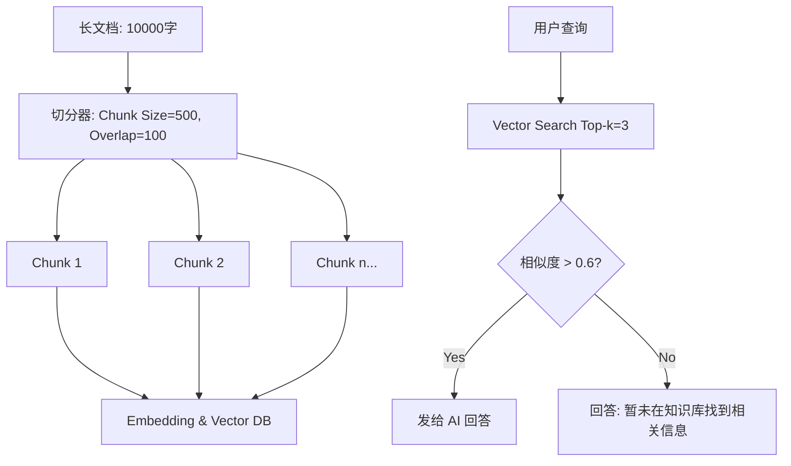

# Day 29：RAG 优化策略 - Chunking 策略与检索过滤

## 🎯 学习目标
*   掌握 **Chunking (分块)**：如何把长文档拆成小块（Fixed-size vs Recursive）。
*   理解 **Overlap (重叠度)** 的重要性：防止一句话被切断。
*   掌握 **Top-k** 和 **Score Threshold (阈值)**：提高检索的质量。
*   学会使用 **Metadata (元数据)** 过滤信息（如：只搜“2023年”的文档）。

---

## 📚 学习资源
*   **Chunking Strategies (深入解析)**: [Pinecone: How to Chunk Text](https://www.pinecone.io/learn/chunking-strategies/)
*   **Vector Search Thresholds**: [Semantic Search Filters Guide](https://docs.trychroma.com/usage-guide#using-where-filters)
*   **LlamaIndex 文档 (进阶)**: [Document Management](https://docs.llamaindex.ai/en/stable/understanding/loading/loading/)

---

## 🛠️ 新手必会知识点 (附例子)

### 1. 递归分块 (Recursive Character Text Splitting)
不要简单的按字符数切分，要按段落 (`\n\n`)、句子 (`。`)、空格切分。
*   **Chunk Size**: 每块的大小（通常 500-1000 字符）。
*   **Overlap**: 相邻两块重叠多少字符（通常 10%-20%），确保语义连贯。

### 2. Top-k 与阈值 (Threshold)
*   **Top-k**: 返回前 K 个最匹配的结果。
*   **Threshold**: 如果相似度得分太低（如 < 0.3），说明内容无关，应该过滤掉。

---

## 🧠 逻辑架构说明 (Mermaid 图示)



---

## 💻 完整可运行范例：高效文档分块与带过滤搜索
模拟将一本书切分成小块，并进行精确的语义检索。

```python
import os
import chromadb
import uuid

# 1. 简单的分块工具函数 (模拟 LangChain 的切分逻辑)
def chunk_text(text, chunk_size=100, overlap=20):
    """
    带重叠的文本切分
    """
    chunks = []
    start = 0
    while start < len(text):
        end = start + chunk_size
        chunks.append(text[start:end])
        # 下一区块的起点 = 当前区块终点 - 重叠度
        start = end - overlap
        if start >= len(text): break
    return chunks

# 2. 准备一段长文本 (模拟长文档)
LONG_DOC = """
这是关于人工智能历史的长篇文章。1956年，达特茅斯会议标志着 AI 的诞生。
随后在 1970 年代经历了第一个寒冬。到了 1990 年代，深蓝击败国际象棋冠军。
进入 21 世纪，深度学习开始爆发。2022 年 OpenAI 发布了 ChatGPT，震惊全球。
"""

def test_chunking_and_search():
    client = chromadb.Client()
    collection = client.create_collection(name="history_doc")

    # --- 步骤 A: 分块处理 ---
    print(f"📄 原始文档长度: {len(LONG_DOC)}")
    chunks = chunk_text(LONG_DOC, chunk_size=50, overlap=10) # 故意设小点方便演示
    print(f"📦 分块完成，共 {len(chunks)} 块。")

    # --- 步骤 B: 存入向量库，附带 Metadata ---
    ids = [str(uuid.uuid4()) for _ in chunks]
    metadatas = [{"source": "history_article", "page": i} for i in range(len(chunks))]
    
    collection.add(
        documents=chunks,
        ids=ids,
        metadatas=metadatas
    )

    # --- 步骤 C: 带过滤条件的搜索 ---
    user_query = "1956年发生了什么？"
    print(f"\n🔍 搜索问题: {user_query}")
    
    results = collection.query(
        query_texts=[user_query],
        n_results=2,
        # 只搜索来自 history_article 的内容 (元数据过滤)
        where={"source": "history_article"} 
    )

    print("✨ 匹配到的最相关内容分块：")
    for i, doc in enumerate(results['documents'][0]):
        # 注意：Chroma 的距离越小表示越接近
        distance = results['distances'][0][i]
        page = results['metadatas'][0][i]['page']
        print(f" - [Page {page}] (Score: {distance:.4f}): {doc}")

if __name__ == "__main__":
    test_chunking_and_search()
```

---

## 💡 老师的建议 (必看)
1.  **分块大小很微妙**：分太小（如 50 字符），一句话没说完就断了，语义不全。分太大（如 5000 字符），发给 AI 会消耗太多 Token。**500-1000 字符** 是通用的甜蜜点。
2.  **Overlap 是灵魂**：没有 Overlap，AI 可能会漏掉跨越两个 Block 的关键信息。
3.  **多看 Score**：在调试 RAG 时，一定要把 `distance` 或 `score` 打印出来。如果搜出来的东西 Score 非常难看，说明你的分块策略或 Embedding 模型有问题。

---

## 📝 本日练习
1.  调整 `chunk_size` 为 10 和 500，分别搜索“2022年发生了什么”，看看结果有什么不同。
2.  **挑战**：尝试用 Python 里的正则表达式 (`re.split`) 写一个按句号 `。` 分块的工具。
3.  思考：如果在 RAG 中，AI 回复“我没找到相关资料”，你是应该增大 `n_results` 还是调整 `chunk_size`？

```
            AI 回复"我没找到相关资料"
                     ↓
┌───────────────────────────────────────┐
│ 第一步：检查检索结果                     │
│ results = collection.query(...)       │
│ 查看 results['documents'] 是否为空？    │
└───────────────────────────────────────┘
                       ↓
    ┌──────────────────┴─────────────────┐
    ↓                                    ↓
  为空                                   不为空
    ↓                                    ↓
 检索失败                                 Prompt问题
 知识库本身没有相关内容         先尝试增大n_results/再尝试chunk_size
```
    