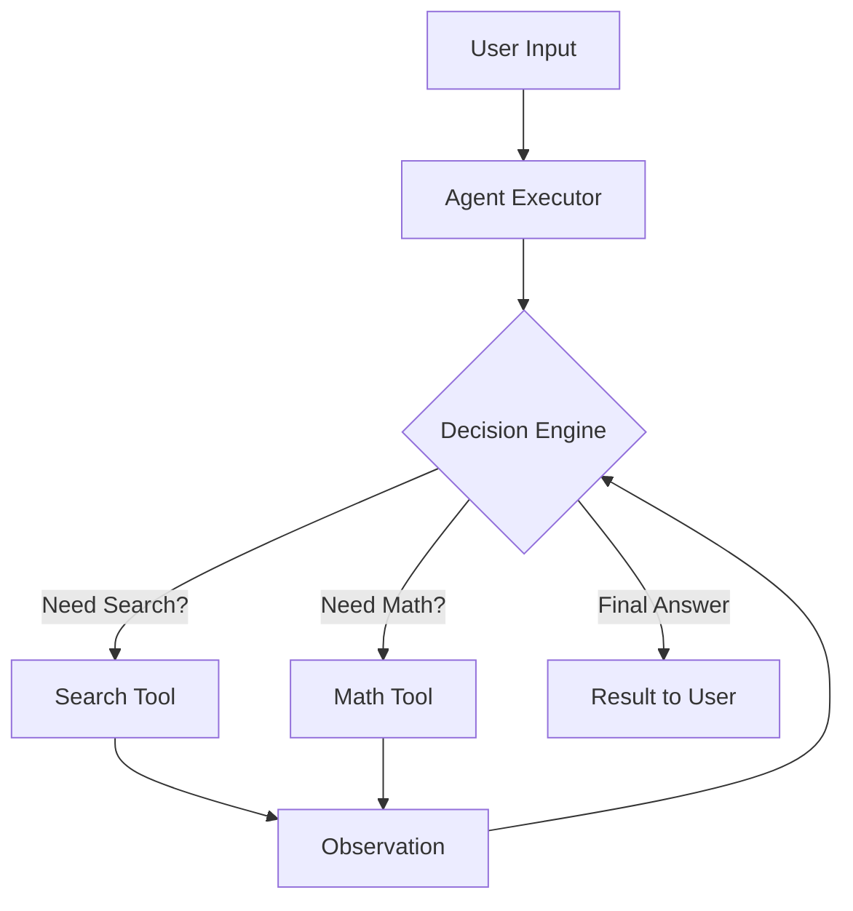

# Day 32：LangChain Memory 与 Agent (让 AI 记住过去与执行操作)

## 🎯 学习目标
*   理解 **Memory (记忆)**：AI 本身没记忆。记忆的本质：将之前的对话历史拼接到新的 messages 参数中，形成“伪记忆”。我们如何通过 LangChain 自动把历史记录塞进上下文。
*   掌握 **ChatMessageHistory**：手动与自动存储对话。
*   初步理解 **Agent (智能体)**：AI 如何自主决策调用哪个工具。
*   学习 LangChain 的 `RunnableWithMessageHistory` 实现多轮对话。

---

## 📚 学习资源
*   **LangChain Memory 教程**: [Memory Implementation Guide](https://python.langchain.com/docs/how_to/#memory)
*   **LangChain Agents**: [Agents Conceptual Guide](https://python.langchain.com/docs/concepts/#agents)
*   **Tool Usage in Agents**: [How to create Custom Tools](https://python.langchain.com/docs/how_to/#tools)

---

## 🛠️ 新手必会知识点 (附例子)

### 1. 记忆 (Memory) 的本质
还记得 Day 18 我们手写的 `messages.append` 吗？LangChain 将其抽象成了 `BaseChatMessageHistory`。
```python
from langchain_community.chat_message_histories import ChatMessageHistory

history = ChatMessageHistory()
history.add_user_message("你好！")
history.add_ai_message("你好，有什么我可以帮你的？")
# history.messages 会返回当前所有消息列表
```

### 2. 什么是 Agent (智能体)？
注意和我们广义说的那个aiagent不一样，这个会资助调用工具。

*   **普通 Chain**：`A -> B -> C` (固定死的一条路)。
*   **Agent**：`A -> ? (根据逻辑选择 B 或 C) -> Result` (AI 决定下一步怎么走)。

---

## 🧠 逻辑架构说明 (Mermaid 图示)



---

## 💻 完整可运行范例：带记忆的 LangChain 聊天助手
使用 LangChain 的新式封装来实现多轮对话记忆。

```python
import os
from langchain_community.chat_models import ChatDashScope
from langchain_core.prompts import ChatPromptTemplate, MessagesPlaceholder
from langchain_core.runnables.history import RunnableWithMessageHistory
from langchain_community.chat_message_histories import ChatMessageHistory

# 1. 准备模型
model = ChatDashScope(model_name="qwen-turbo")

# 2. 准备带占位符的 Prompt (占位符用于存放历史记录)
prompt = ChatPromptTemplate.from_messages([
    ("system", "你是一个幽默风趣的 AI 助手。"),
    # 这里的history就是下面history_messages_key设置的值
    MessagesPlaceholder(variable_name="history"), # 这里会注入历史消息
    ("user", "{input}")
])

# 3. 构建基础链
chain = prompt | model

# 4. 封装记忆逻辑 (使用内存存储)
store = {} # 用于存储不同 session_id 的历史记录

def get_session_history(session_id: str):
    if session_id not in store:
        store[session_id] = ChatMessageHistory()
    return store[session_id]

# 核心：使用 RunnableWithMessageHistory 自动管理对话记录
with_history_chain = RunnableWithMessageHistory(
    chain,
    get_session_history,
    # 设置输入数据中，哪个字段存放用户的新消息
    input_messages_key="input",
    # 设置Prompt 模板中，哪个占位符用来插入历史记录
    history_messages_key="history",
)

# --- Main ---
if __name__ == "__main__":
    config = {"configurable": {"session_id": "test_user_01"}}
    
    print("🤖 AI: 你好，我是小 Q，你想聊点什么？")
    while True:
        user_text = input("👤 用户: ")
        if user_text.lower() in ["exit", "退出"]: break
        
        response = with_history_chain.invoke(
            #这的input就是上面input_messages_key设置的值
            {"input": user_text},
            config=config
        )
        print(f"🤖 AI: {response.content}")
```

---

## 💡 老师的建议 (必看)
1.  **session_id 是关键**：在真实项目中，你会通过 `session_id` 来区分不同的用户。你可以把 `store` 替换成 Redis 或数据库来持久化这些记忆。
2.  **别让记忆太长**：如果历史记录太多，AI 会变慢且变贵。可以考虑只保留最近 10 条（使用 `ConversationSummaryMemory` 总结历史）。
3.  **Agent 进阶**：今天我们学会了记忆。明后天我们将开始学习如何把 RAG (Day 28) 和 Agent 结合起来。

---

## 📝 本日练习
1.  修改上面的代码，尝试开启另一个 `session_id` (如 `test_user_02`)，看看 AI 是否会混淆两个用户的对话。
2.  **挑战**：尝试在 `prompt` 里加入一条规则：`"如果用户提到'秘密'，请在后续所有回复中都带上一个 Emoji 🎭。"`
3.  思考：如果用户的网络断了，`store` 里的内存记忆会丢失吗？该如何改进？
    