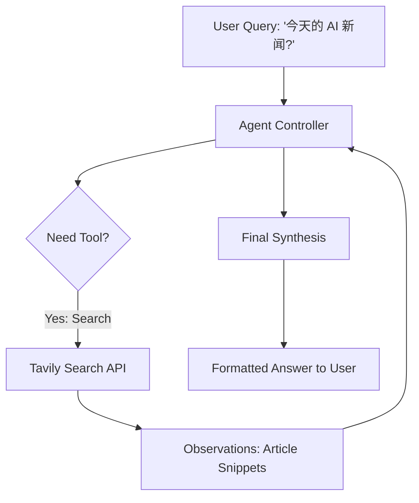

# Day 35：实战项目 - 使用 LangChain 实现一个带联网搜索的 AI 助手

## 🎯 学习目标

- 整合 **LangChain Agents**、**Google Search (Tavily)** 和 **Qwen API**。
- 理解什么是 **Tool (工具)**：如何让 AI 具备“查实时信息”的能力。
- 学习如何处理 AI 生成的工具调用逻辑 (Action/Observation)。
- 实现一个可以回答“今天新闻是什么”的实时 AI 助手。

---

## 📚 学习资源

- **Tavily Search API (强烈推荐给开发者)**: [Tavily.com](https://tavily.com/) (专为 AI Agent 优化的搜索 API)
- **LangChain Tool Tutorial**: [Defining Custom Tools](https://python.langchain.com/docs/how_to/#tools)
- **SerpAPI (另一种搜索 API)**: [SerpApi.com](https://serpapi.com/) (Google 搜索结果抓取)

---

## 🛠️ 新手必会知识点 (附例子)

### 1. 为什么需要联网搜索？

大模型的训练数据是有截止日期 (Knowledge Cutoff) 的。比如 Qwen 可能不知道今天早上发生了什么。通过 **Agent Tool**，AI 可以“临时抱佛脚”去查 Google，再回来总结给你。

### 2. Tavily API

Tavily 是目前最受 AI 开发者欢迎的搜索工具，它可以直接返回清洗好的、适合 AI 阅读的网页摘要。

```python
from langchain_community.tools.tavily_search import TavilySearchResults

# 需要提前在环境变量里设置 TAVILY_API_KEY
search = TavilySearchResults()
results = search.run("2024年4月14日有哪些重大 AI 新闻？")
```

---

## 🧠 逻辑架构说明 (Mermaid 图示)



---

## 💻 完整可运行范例：实时 AI 新闻助手 (Tavily + Qwen)

这是一个具备“自主查资料”能力的完整 Agent。

```python
import os
from langchain_community.chat_models import ChatDashScope
from langchain_community.tools.tavily_search import TavilySearchResults
from langchain.agents import initialize_agent, AgentType

# 1. 准备搜索工具 (确保 TAVILY_API_KEY 已设置，可在 tavily.com 免费申请)
# 如果你没有 Tavily Key，也可以自定义一个函数模拟搜索

search = TavilySearchResults(k=3) # 返回前 3 条最相关的结果

# 这种做法是让agent自己决定是否要使用网络搜索的
tools = [
    search # 将 Tavily 搜索加入 Agent 的工具包
]

# 2. 准备 Qwen 大脑 (Qwen-Max 在 Agent 决策上更稳定)
llm = ChatDashScope(model_name="qwen-max", temperature=0)

# 3. 初始化 Agent
agent = initialize_agent(
    tools,
    llm,
    agent=AgentType.ZERO_SHOT_REACT_DESCRIPTION,
    verbose=True # 非常重要：展示 AI 的思考过程 (ReAct 循环)
)

# --- Main ---
if __name__ == "__main__":
    print("🌍 实时 AI 新闻助手启动！")

    query = "请帮我查一下，最近三天内全球 AI 领域有哪些重大的技术突破或发布？"

    try:
        print(f"\n🚀 正在处理问题: {query}")
        response = agent.run(query)

        print("\n" + "="*50)
        print("✨ AI 的总结报告：")
        print(response)
        print("="*50)
    except Exception as e:
        print(f"❌ 运行失败，可能是网络问题或 API Key 错误: {e}")
```

---

## 💡 老师的建议 (必看)

1.  ** Agent 可能会“打转”**：有时 AI 会进入无限循环 (Thought -> Action -> Observation -> Thought...)。可以通过设置 `max_iterations=5` 来强制终止。
2.  **Tavily 的优势**：普通的 Google 搜索返回的是带广告的网页链接，而 Tavily 返回的是纯文本内容，这能节省大量的 Token 费用。
3.  **安全性 (Safety)**：不要给 Agent 赋予执行删除文件等敏感操作的工具，除非你有严格的权限检查。

---

## 📝 本日练习

1.  成功申请 Tavily API Key 并运行上面的代码。如果没有 Key，尝试自己写一个 `def my_mock_search(q): return "..."` 的函数，并用 `Tool(func=my_mock_search, ...)` 封装给 Agent。
2.  **思考题**：如果搜索结果里有 10 个很长的网页，Agent 会不会因为 Token 超限而崩溃？该如何处理？（提示：结合 Day 29 的 **Chunking** 思想）。
3.  挑战：将 Day 30 的 **本地知识库** 和今天的 **联网搜索** 合并成两个工具，做一个“内外兼修”的助手——先查本地文档，查不到再去联网搜索。 _(提示：通过 Tool 的 description 来引导 AI 的偏好顺序。)_
